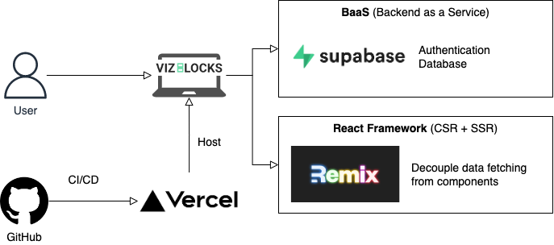

# VizBlocks

## Installation

```sh
npm install
npm run dev
```

## Description



The project uses [Remix](https://remix.run/), which is a full stack web framework that lets you focus on the user interface and work back through web fundamentals to deliver a fast, slick, and resilient user experience. The backend is powered by [Supabase](https://app.supabase.com/).

It includes `@mui/material` and its peer dependencies, including `emotion`, the default style engine in MUI v5.

## Useful Links

- [Figma](https://www.figma.com/file/a4ImnlyDuAM9VaToEpvb06/VizBlocks?node-id=13%3A199)
- [Kanban Board](https://trello.com/b/llRRr5nl/vizblocks-kanban)
- [Supabase Dashboard](https://app.supabase.com/project/tgpjlibcewdbjsnrugjo)
- [Survey 1](https://docs.google.com/forms/d/1EnHtxuqj69nTUgkXoB-LnA3iYJTz1szBRTdoQhmAi2o/edit)
- [Survey 1 Results](https://docs.google.com/spreadsheets/d/16k9V9wS6_c9JXr0EEFjutfhDhG-lqMnJWZp9AoIRN6U/edit?resourcekey#gid=396126995)
- [Survey 2](https://docs.google.com/forms/d/1bX2N6X8Ra4hA0HHxM7AJeMljGixfW1DP-m2QL0UviZg/edit#responses)
- [Survey 2 Results](https://docs.google.com/spreadsheets/d/1mwTpuEHYKyQ5yRoOxVOwzaa8DY9-PNTm2mAs2foTyX0/edit?resourcekey=undefined#gid=472620055)

## Notes
The deployment uses vercel which provides a hobby tier for personal projects. As this repo has been migrated to the VisualizationLiteracy organisation, vercel requires us to use a Team account which requires $$$. A work around is to move this folder to a personal repo again to set up the CI/CD.
